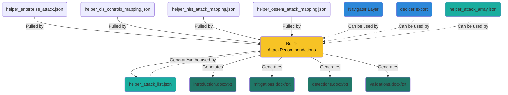
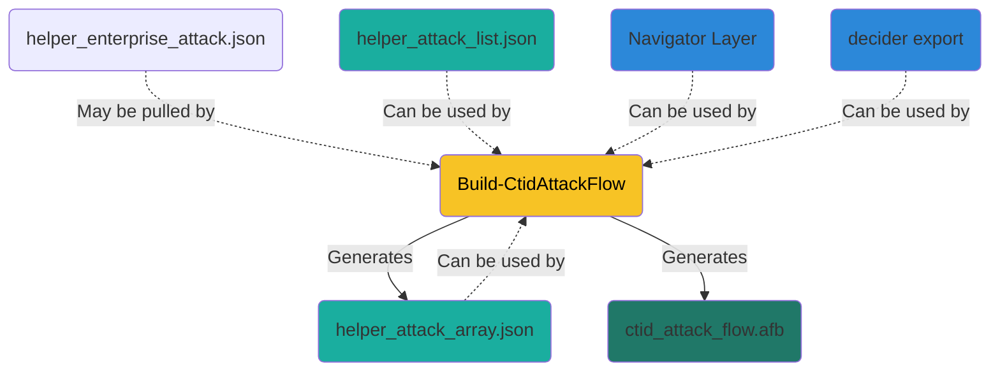
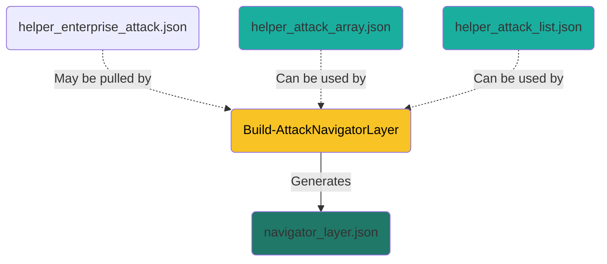
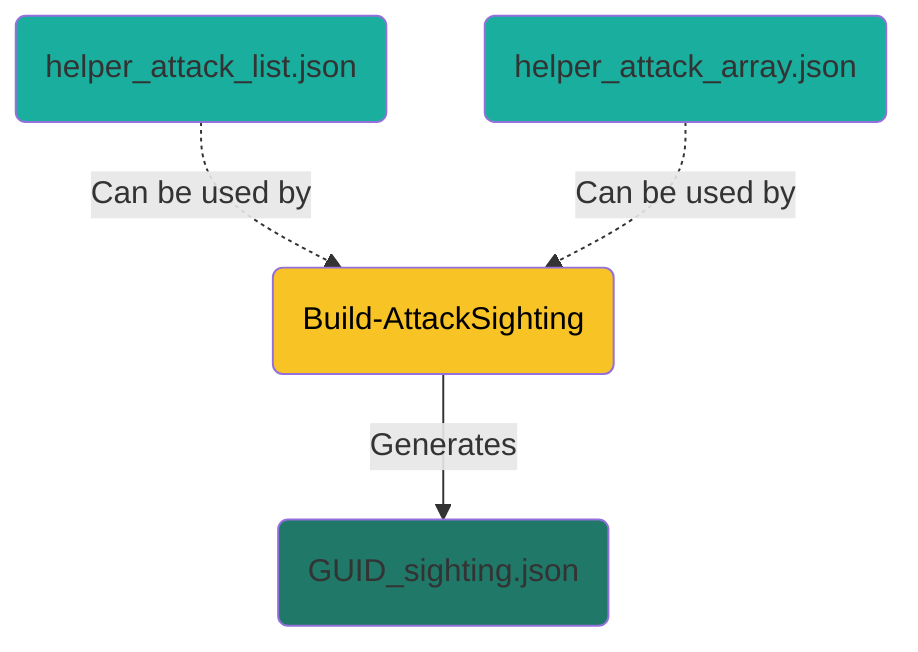

# Build-AttackRecommendations

## Prerequisites
There's still a manual component involved for the results to be generated, namely the identification of the observed (Sub-)Techniques. Another MITRE project, [TRAM](https://github.com/center-for-threat-informed-defense/tram/), or [CISA's decider](https://github.com/cisagov/decider) has the potential aiding with this. TRAM may eventually automate the process but is still at an academic/research level whereas decider is a fully functional environment.

So we still require an analyst, preferably not the owner/originator/writer of the report, to skim manually through the report for identifying the possible ATT&CK® (Sub-)Techniques.

### Input
The following options are available as input
- A manually compiled list of ATT&CK® (Sub-)Techniques, for example T1486;T1490;T1027;T1047;T1036;T1059;T1562;T1112;T1204;T1055
- An ATT&CK® Navigator JSON file, created via [ATT&CK® Navigator](https://mitre-attack.github.io/attack-navigator/) or other applications allowing to export these, such as [CISA's decider](https://github.com/cisagov/decider)
- A CISA decider exported JSON file, exported from [CISA's decider](https://github.com/cisagov/decider)
- An automatically compiled list of ATT&CK® (Sub-)Techniques generated from Build-AttackRecommendations in the file helper_cis_controls_mapping.json
- An automatically compiled list of ATT&CK® (Sub-)Techniques generated from Build-CtidAttackFlow in the file helper_attack_array.json

### Output
- Microsoft Word (requires a local installation of Microsoft Office)
- Simplified TXT files

## Installation
Pull the [module](../module)

    PS> Import-Module .\AttackIrReporting.psd1 

## Running
It is recommended to run the function in an empty temporary directory. All the required files will be pulled.

    PS> Build-AttackRecommendations 

### Manual Input

The function requests a single or a list of identified (Sub-)Techniques to be given in the format used by MITRE to define these, eg [T1059.001](https://attack.mitre.org/techniques/T1059/001/)

    Give a single or a semicolon seperated list of ATTACK IDs (for example: T1566.002;T1018;T1033):

### ATT&CK® Navigator JSON

An ATT&CK® Navigator JSON file can be passed with the parameter `-NavigatorFile`

    PS> Build-AttackRecommendations -NavigatorFile navigator_layer.json

### CISA decider exported JSON

A CISA decider exported JSON file can be passed with the parameter `-DeciderFile`

    PS> Build-AttackRecommendations -DeciderFile untitled-2023-04-19_19-10-48.json

### Output
If Microsoft Office is installed and detected, WORD documents introduction.docx, mitigations.docx, and detections.docx will be generated. Snippets of these documents are shown below:

Should that not be the case, simplified TXT files will be generated instead.

## Downloads/Generating
The following files are to be expected to be downloaded or generated when the script is run:
- helper_enterprise_attack.json (downloaded from Mitre Github)
- helper_cis_controls_mapping.json (downloaded from nightly-nessie Github)
- helper_nist_attack_mapping.json (downloaded from CTID Github)
- helper_ossem_attack_mapping.json (downloaded from OSSEM-DM Github)
- introduction.docx|txt (generated)
- mitigations.docx|txt (generated)
- detections.docx|txt (generated)
- validations.docx|txt (generated)
- helper_attack_list.json (generated)

## Issues/Notes

 - The provided helper_cis_controls_mapping.json is an unofficial STIX formatted [CIS Controls mapping against ATT&CK v12.1](https://www.cisecurity.org/controls/v8).
 - The downloaded helper_nist_attack_mapping.json is at the time of release [mapping NIST 800-53 Rev 4 and Rev 5 against ATT&CK v10.1](https://github.com/center-for-threat-informed-defense/attack-control-framework-mappings)
 - The generated recommendations may be overwhelming to a customer and may require reduction to be digestible for the intended audience. This is also tied to the maturity and having that conversation with the customer feels like the only right way to do so.

# Build-CtidAttackFlow

## Prerequisites

### Input
The following options are available as input
- A manually compiled list of ATT&CK® (Sub-)Techniques, for example T1486;T1490;T1027;T1047;T1036;T1059;T1562;T1112;T1204;T1055
- An automatically compiled list of ATT&CK® (Sub-)Techniques generated from Build-AttackRecommendations in the file helper_cis_controls_mapping.json
- An automatically compiled list of ATT&CK® (Sub-)Techniques generated from Build-CtidAttackFlow in the file helper_attack_array.json
- An ATT&CK® Navigator JSON file, created via [ATT&CK® Navigator](https://mitre-attack.github.io/attack-navigator/) or other applications allowing to export these, such as [CISA's decider](https://github.com/cisagov/decider)
- A CISA decider exported JSON file, exported from [CISA's decider](https://github.com/cisagov/decider)

## Installation
Pull the [module](../module)

    PS> Import-Module .\AttackIrReporting.psd1 

## Running
It is recommended to run the script the temporary directory used with Build-AttackRecommendations so it can take advantage of the previously generated helper_attack_list.json. It will also take advantage of a previously generated helper_attack_array.json.

    PS> Build-CtidAttackFlow 

### ATT&CK® Navigator JSON

An ATT&CK® Navigator JSON file can be passed with the parameter `-NavigatorFile`

    PS> Build-CtidAttackFlow -NavigatorFile navigator_layer.json

### CISA decider exported JSON

A CISA decider exported JSON file can be passed with the parameter `-DeciderFile`

    PS> Build-CtidAttackFlow -DeciderFile untitled-2023-04-19_19-10-48.json

### helper_cis_controls_mapping.json

If none of the above are provided, the script will revert to the helper file.

### helper_attack_list.json
The script uses the previously generated helper_attack_list.json from Build-AttackRecommendations which defines the (Sub-)Techniques.

### helper_attack_array.json
The script uses the previously generated helper_attack_array.json from Build-CtidAttackFlow which defines the (Sub-)Techniques/Tactic Pairs.

### Manual Input

The scripts requests a single or a list of identified (Sub-)Techniques to be given in the format used by MITRE to define these, eg [T1059.001](https://attack.mitre.org/techniques/T1059/001/)

    Give a single or a semicolon seperated list of ATTACK IDs (for example: T1566.002;T1018;T1033):

### (Sub-)Technique - Tactic pair validation

During runtime, the script will request to validate the (Sub-)Techniques / Tactic pairs if multiple options are possible, eg [T1078](https://attack.mitre.org/techniques/T1078/) can be tied to the followiung Tactics: Defense Evasion, Persistence, Privilege Escalation, and Initial Access. The validation is skipped if there is only one pair identified.

### Assets

The script will also provide the option to generate Assets.

    Do you need Assets to be generated ([Y]/N): y
    Give a single or a semicolon seperated list of asset names to generate (for example: SYSTEM01;SRV-EXCH-01;Obsolete Device):

### Output

The generated afb file can be opened with the [MITRE ATT&CK® Flow Builder](https://center-for-threat-informed-defense.github.io/attack-flow/ui/) and would look like:

## Downloads/Generation
The following files are to be expected to be downloaded (if not already present) or generated when the script is run:
- helper_enterprise_attack.json (downloaded from Mitre Github)
- ctid_attack_flow.afb (generated)
- helper_attack_array.json (generated)

## Issues/Notes

- The ctid_attack_flow.afb is a starting point that generates the Actions per identified (Sub-)Technique / Tactic pair. It may also include the optional Assets. According to the available information and detail required, many more work needs to be performed on the flow itself within the Builder.
- Some fields of ctid_attack_flow.afb are prefilled for Check Point IRT, this can be changed in the script code.
- The colour scheme of ctid_attack_flow.afb cannot be changed in the GUI of the Builder but can be addressed in the script code

> $var_obj_flow_property_background_colour = "#ffffff"

...

> $var_obj_flow_objects_property_box_colour = "#fefefe"

# Build-AttackNavigatorLayer

## Prerequisites

### Input
The following options are available as input
- A manually compiled list of ATT&CK® (Sub-)Techniques, for example T1486;T1490;T1027;T1047;T1036;T1059;T1562;T1112;T1204;T1055
- An automatically compiled list of ATT&CK® (Sub-)Techniques generated from Build-CtidAttackFlow in the file helper_attack_array.json
- An automatically compiled list of ATT&CK® (Sub-)Techniques generated from Build-AttackRecommendations in the file helper_cis_controls_mapping.json

## Installation
Pull the [module](../module)

    PS> Import-Module .\AttackIrReporting.psd1 

## Running
It is recommended to run the script the temporary directory used with Build-CtidAttackFlow and/or Build-AttackRecommendations so it can take advantage of the generated files.

    PS> Build-AttackNavigatorLayer  

### helper_attack_array.json
The script uses the previously generated helper_attack_array.json from Build-CtidAttackFlow which defines the (Sub-)Techniques/Tactic pairs.

### helper_attack_list.json
The script uses the previously generated helper_attack_list.json from Build-AttackRecommendations which defines the (Sub-)Techniques. All the availabe (Sub-)Techniques/Tactic pairs will be generated.

### Manual Input
If none of the helper files are present, the script requests a single or a list of identified (Sub-)Techniques to be given in the format used by MITRE to define these, eg [T1059.001](https://attack.mitre.org/techniques/T1059/001/)

    Give a single or a semicolon seperated list of ATTACK IDs (for example: T1566.002;T1018;T1033):

In this case, all the availabe (Sub-)Techniques/Tactic pairs will be generated.

## Downloads/Generating
The following files are to be expected to be downloaded (if not already present) or generated when the script is run:
- helper_enterprise_attack.json (downloaded from Mitre Github)
- navigator_layer.json (generated)

## Issues/Notes

- When maual input is provided or when the input from helper_attack_list.json is used, the layer will include all (Sub-)Techniques/Tactic pairs. With the input from helper_attack_array.json it will only generate the (Sub-)Techniques for the specified associated Tactic.

# Build-AttackSighting

## Prerequisites

### Input
The following options are available as input
- A manually compiled list of ATT&CK® (Sub-)Techniques, for example T1486;T1490;T1027;T1047;T1036;T1059;T1562;T1112;T1204;T1055
- An automatically compiled list of ATT&CK® (Sub-)Techniques generated from Build-AttackRecommendations in the file helper_cis_controls_mapping.json
- An automatically compiled list of ATT&CK® (Sub-)Techniques generated from Build-CtidAttackFlow in the file helper_attack_array.json

## Installation
Pull the [module](../module)

    PS> Import-Module .\AttackIrReporting.psd1

## Running
It is recommended to run the script the temporary directory used with Build-CtidAttackFlow and/or Build-AttackRecommendations so it can take advantage of the generated files.

    PS> Build-AttackSighting 

### helper_attack_array.json
The script uses the previously generated helper_attack_array.json from Build-CtidAttackFlow which defines the (Sub-)Techniques/Tactic pairs.

### helper_attack_list.json
The script uses the previously generated helper_attack_list.json from Build-AttackRecommendations which defines the (Sub-)Techniques.

### Manual Input
If that helper file is not present, the script requests a single or a list of identified (Sub-)Techniques to be given in the format used by MITRE to define these, eg [T1059.001](https://attack.mitre.org/techniques/T1059/001/)

    Give a single or a semicolon seperated list of ATTACK IDs (for example: T1566.002;T1018;T1033):

### Technique Sightings
During runtime, the script will request additional input for the sighting of the previously identified ATT&CK® (Sub-)Techniques.

### Software Sightings
The script will also provide an option to include a software sighting.

## Downloads/Generating
The following files are to be expected to be generated when the script is run:
- GUID_sighting.json (generated)

## Issues/Notes

- None.
